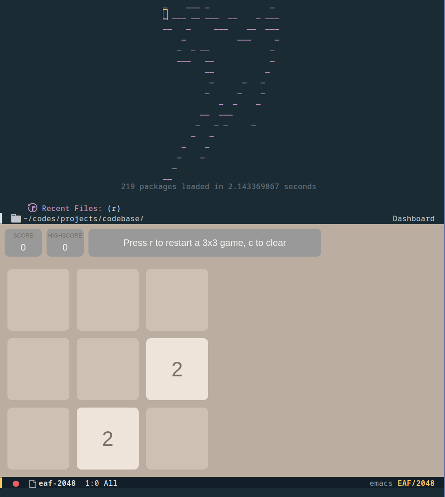
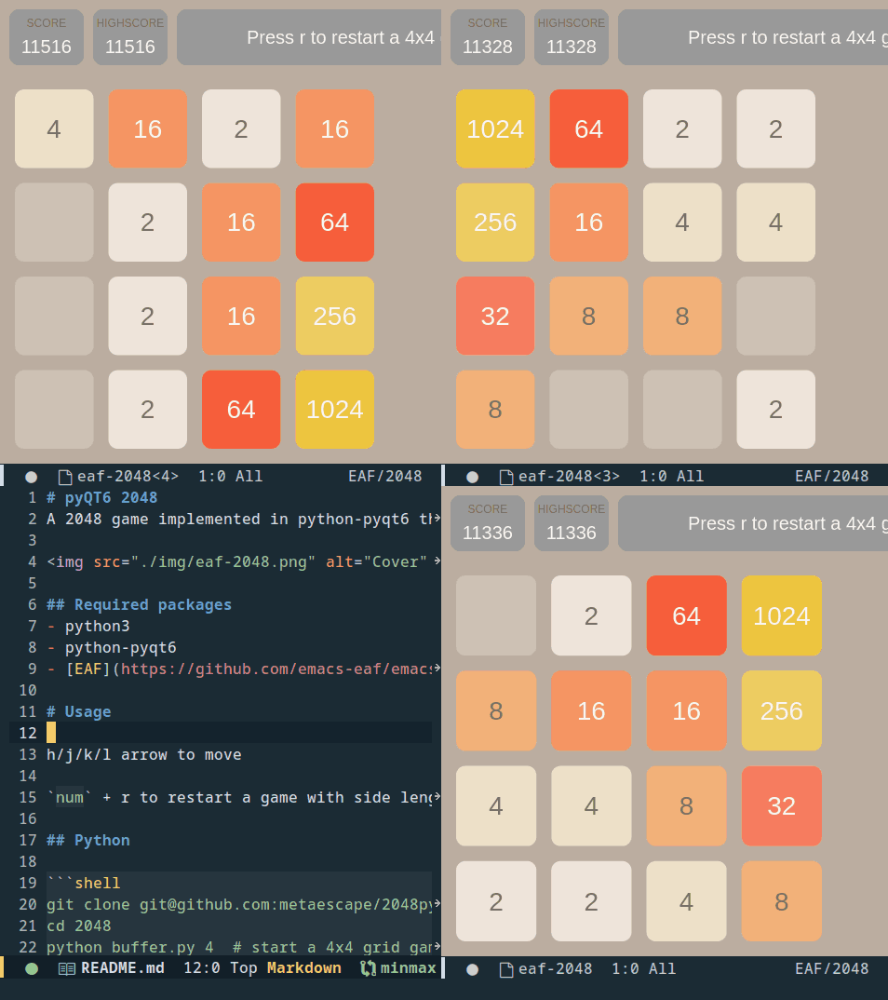

# pyQT6 2048
A 2048 game implemented in python-pyqt6 that can also run in [EAF](https://github.com/emacs-eaf/emacs-application-framework)



## Required packages
- python3
- python-pyqt6
- [EAF](https://github.com/emacs-eaf/emacs-application-framework) if you want to run it in emacs

# Usage

h/j/k/l arrow to move

`num` + r to restart a game with side length `num`

## Python

```shell
git clone git@github.com:metaescape/2048pyqt6.git 2048
cd 2048
python buffer.py 4  # start a 4x4 grid game
python buffer.py 0  # watch AI play a 4x4 game
```

## EAF

- [Install EAF](https://github.com/emacs-eaf/emacs-application-framework#install) first

- move this repo to the `app` subdirectory of eaf, e.g. "~/.emacs.d/site-lisp/emacs-application-framework/app"
  and rename it to 2048:
```shell
git clone git@github.com:metaescape/2048pyqt6.git 2048
mv 2048 ~/.emacs.d/site-lisp/emacs-application-framework/app
```

or 

```shell
git clone git@github.com:metaescape/2048pyqt6.git ~/.emacs.d/site-lisp/emacs-application-framework/app/2048
```

or
```shell
cd ~/.emacs.d/site-lisp/emacs-application-framework/
./install-eaf.py --install 2048
```

- add below code in your emacs config:

```Elisp
(add-to-list 'load-path "~/.emacs.d/site-lisp/emacs-application-framework/")
(require 'eaf)
(require 'eaf-2048)
```

- M-x eaf-open-2048: chose a gridsie to start

- M-x eaf-open-2048-ai: watch AI play 2048
e.g. three AI's 2048 competition in emacs

recorded via [emacs-gif-screencast](https://github.com/Ambrevar/emacs-gif-screencast)

# original
QT: https://github.com/jingdao/2048-pyqt 

AI: https://github.com/kcwu/2048-python
